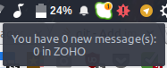
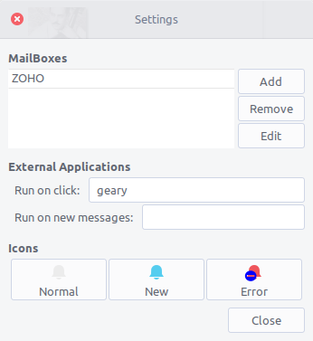
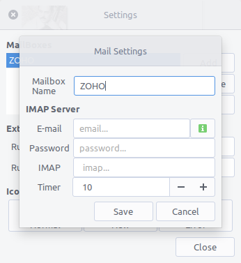

# mailchecker
This is an attempt to create a simple mail checker
until now it has been tested on GNU/Linux only and uses IMAP only

Requirements:
--------------
gtk2  
python2
pygtk
PyGObject 3.10.2+
python-crypto

How To Use:
------------
1. Simply run "Mail Checker"
2. In the settings dialog place you email and your password.

Example for what you might type into the mail settings dialog:
---------------------------------------------------
```
example@mail.com  
PASSWORD
imap.mail.com
```
### as for the IMAP field, here's an example of what you should type in:
- Gmail -> `imap.gmail.com`
- Yahoo -> `imap.yahoo.com`

Screenshots
-----------
##### Trayicon states:

.png)

<br />
##### Trayicon hover:

<br />
##### Settings - Mail settings:



TO-DO list:
------------
- [x] App freezes when checking for mails, that needs to be fixed (maybe use threads?).
- [x] Restart timer on new mail account.
- [x] Change tray icon color and send a notification if mail account data is invaild or wrong
- [x] Create new method - on_new_mail() - for better code readiblity and organization.
- [x] Support for multiple accounts.
- [x] User can change applet icons from the settings dialog.
- [x] User can run a command or a script if he recieves a new mail.
- [x] User can run a command or a script if he left-click on the tray icon.
- [x] User can set the check-mail timer
- [ ] Save user data in default configuration folder (in the ~/.config/ or something).
- [x] Edit existing mail account.
- [x] Handle the situation of "No internet connection"
- [x] Save mail aacounts on a database instead of credentiatls file
